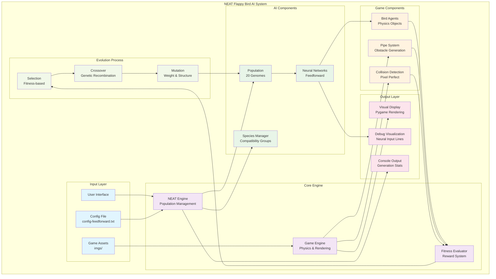
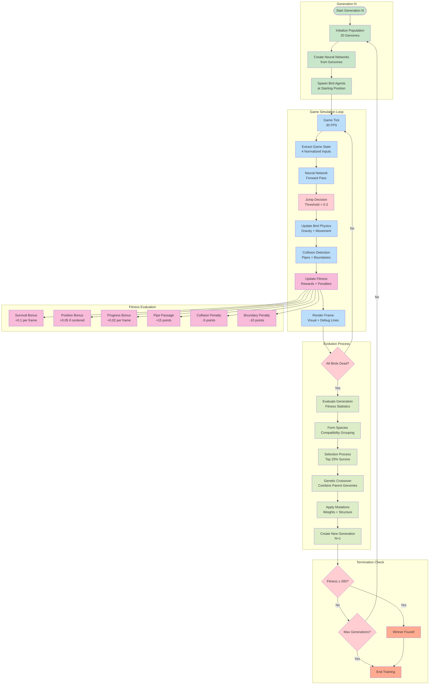
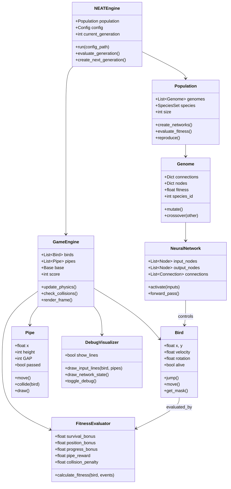
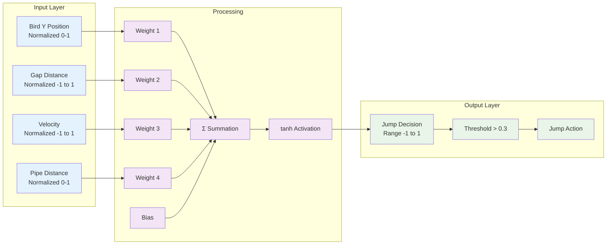
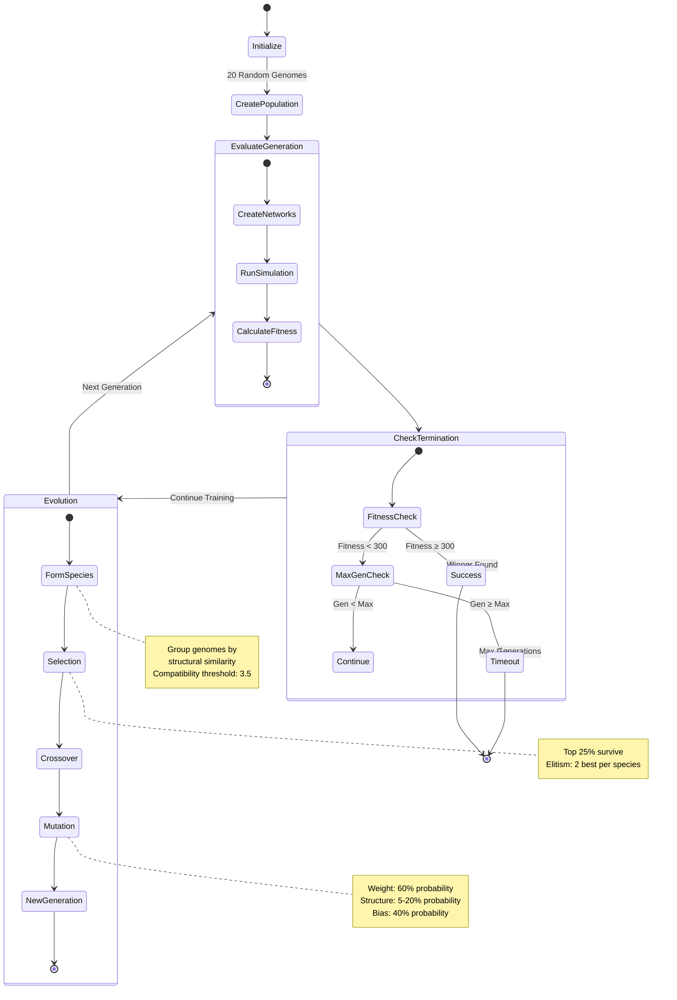

# NEAT Flappy Bird AI - System Architecture & Diagrams

## Table of Contents
1. [System Block Diagram](#system-block-diagram)
2. [Data Flow Diagram](#data-flow-diagram)
3. [Component Architecture](#component-architecture)
4. [Neural Network Architecture](#neural-network-architecture)
5. [NEAT Evolution Flow](#neat-evolution-flow)

---

## System Block Diagram

### Mermaid Code


### Text-Based Architecture
```
┌─────────────────────────────────────────────────────────────────┐
│                    NEAT Flappy Bird AI System                  │
├─────────────────────────────────────────────────────────────────┤
│                                                                 │
│  ┌─────────────┐    ┌─────────────┐    ┌─────────────┐         │
│  │ User Input  │    │ Config File │    │ Game Assets │         │
│  │ (Keyboard)  │    │ Parameters  │    │ (Images)    │         │
│  └──────┬──────┘    └──────┬──────┘    └──────┬──────┘         │
│         │                  │                  │                │
│         └──────────────────┼──────────────────┘                │
│                            │                                   │
│  ┌─────────────────────────▼─────────────────────────┐         │
│  │              NEAT Engine Core                     │         │
│  │  ┌─────────────┐ ┌─────────────┐ ┌─────────────┐ │         │
│  │  │ Population  │ │ Species     │ │ Fitness     │ │         │
│  │  │ Manager     │ │ Manager     │ │ Evaluator   │ │         │
│  │  └─────────────┘ └─────────────┘ └─────────────┘ │         │
│  └─────────────────────────┬─────────────────────────┘         │
│                            │                                   │
│  ┌─────────────────────────▼─────────────────────────┐         │
│  │              Game Simulation Layer                │         │
│  │  ┌─────────────┐ ┌─────────────┐ ┌─────────────┐ │         │
│  │  │ Neural      │ │ Bird        │ │ Pipe        │ │         │
│  │  │ Networks    │ │ Agents      │ │ System      │ │         │
│  │  └─────────────┘ └─────────────┘ └─────────────┘ │         │
│  └─────────────────────────┬─────────────────────────┘         │
│                            │                                   │
│  ┌─────────────────────────▼─────────────────────────┐         │
│  │              Output & Visualization               │         │
│  │  ┌─────────────┐ ┌─────────────┐ ┌─────────────┐ │         │
│  │  │ Game        │ │ Debug       │ │ Console     │ │         │
│  │  │ Display     │ │ Lines       │ │ Stats       │ │         │
│  │  └─────────────┘ └─────────────┘ └─────────────┘ │         │
│  └─────────────────────────────────────────────────────────────┘         │
└─────────────────────────────────────────────────────────────────┘
```

---

## Data Flow Diagram

### Mermaid Code


### Text-Based Data Flow
```
Generation N Start
        │
        ▼
┌───────────────────┐
│ Initialize        │
│ Population (20)   │
└─────────┬─────────┘
          │
          ▼
┌───────────────────┐
│ Create Neural     │
│ Networks          │
└─────────┬─────────┘
          │
          ▼
┌───────────────────┐    ┌─────────────────────────────────┐
│ Spawn Birds       │    │         Game Loop               │
│ (Starting Pos)    │───▶│                                 │
└───────────────────┘    │  ┌─────────────────────────┐    │
                         │  │ 1. Extract Inputs       │    │
                         │  │    • Bird Y Position    │    │
                         │  │    • Gap Distance       │    │
                         │  │    • Velocity           │    │
                         │  │    • Pipe Distance      │    │
                         │  └─────────┬───────────────┘    │
                         │            │                    │
                         │            ▼                    │
                         │  ┌─────────────────────────┐    │
                         │  │ 2. Neural Network       │    │
                         │  │    Forward Pass         │    │
                         │  └─────────┬───────────────┘    │
                         │            │                    │
                         │            ▼                    │
                         │  ┌─────────────────────────┐    │
                         │  │ 3. Decision Making      │    │
                         │  │    if output > 0.3      │    │
                         │  │    then jump()          │    │
                         │  └─────────┬───────────────┘    │
                         │            │                    │
                         │            ▼                    │
                         │  ┌─────────────────────────┐    │
                         │  │ 4. Physics Update       │    │
                         │  │    • Apply Gravity      │    │
                         │  │    • Move Objects       │    │
                         │  │    • Check Collisions   │    │
                         │  └─────────┬───────────────┘    │
                         │            │                    │
                         │            ▼                    │
                         │  ┌─────────────────────────┐    │
                         │  │ 5. Fitness Update       │    │
                         │  │    Rewards:             │    │
                         │  │    • +0.1 survival      │    │
                         │  │    • +0.05 position     │    │
                         │  │    • +0.02 progress     │    │
                         │  │    • +15 pipe pass      │    │
                         │  │    Penalties:           │    │
                         │  │    • -5 collision       │    │
                         │  │    • -10 boundary       │    │
                         │  └─────────┬───────────────┘    │
                         │            │                    │
                         │            ▼                    │
                         │  ┌─────────────────────────┐    │
                         │  │ 6. Render Frame         │    │
                         │  │    • Game Objects       │    │
                         │  │    • Debug Lines        │    │
                         │  │    • UI Elements        │    │
                         │  └─────────┬───────────────┘    │
                         │            │                    │
                         └────────────┼────────────────────┘
                                      │
                                      ▼
                              ┌───────────────┐
                              │ All Birds     │
                              │ Dead?         │
                              └───────┬───────┘
                                      │
                         ┌────────────┴────────────┐
                         │ No                      │ Yes
                         ▼                         ▼
                 ┌───────────────┐    ┌─────────────────────────┐
                 │ Continue      │    │    Evolution Process    │
                 │ Game Loop     │    │                         │
                 └───────────────┘    │ 1. Evaluate Fitness     │
                                      │ 2. Form Species         │
                                      │ 3. Selection (25%)      │
                                      │ 4. Crossover           │
                                      │ 5. Mutation            │
                                      │ 6. Create New Gen      │
                                      └─────────┬───────────────┘
                                                │
                                                ▼
                                      ┌─────────────────────────┐
                                      │ Fitness ≥ 300 or       │
                                      │ Max Generations?        │
                                      └─────────┬───────────────┘
                                                │
                                   ┌────────────┴────────────┐
                                   │ No                      │ Yes
                                   ▼                         ▼
                           ┌───────────────┐        ┌───────────────┐
                           │ Start Next    │        │ Training      │
                           │ Generation    │        │ Complete      │
                           └───────────────┘        └───────────────┘
```

---

## Component Architecture

### Mermaid Code


### Text-Based Component Structure
```
NEAT Flappy Bird AI Components
├── Core Engine Layer
│   ├── NEATEngine
│   │   ├── Population Management
│   │   ├── Generation Control
│   │   └── Evolution Orchestration
│   │
│   ├── GameEngine
│   │   ├── Physics Simulation
│   │   ├── Collision Detection
│   │   └── Rendering Pipeline
│   │
│   └── FitnessEvaluator
│       ├── Reward Calculation
│       ├── Penalty Assessment
│       └── Performance Metrics
│
├── AI Components Layer
│   ├── Population
│   │   ├── Genome Collection (20)
│   │   ├── Species Management
│   │   └── Reproduction Control
│   │
│   ├── Genome
│   │   ├── Connection Genes
│   │   ├── Node Genes
│   │   └── Mutation Operations
│   │
│   └── NeuralNetwork
│       ├── Input Layer (4 nodes)
│       ├── Hidden Layer (0+ nodes)
│       └── Output Layer (1 node)
│
├── Game Objects Layer
│   ├── Bird
│   │   ├── Physics Properties
│   │   ├── Movement Control
│   │   └── Collision Bounds
│   │
│   ├── Pipe
│   │   ├── Obstacle Generation
│   │   ├── Gap Positioning
│   │   └── Movement Logic
│   │
│   └── Base
│       ├── Ground Representation
│       └── Scrolling Animation
│
└── Visualization Layer
    ├── GameRenderer
    │   ├── Sprite Drawing
    │   ├── UI Elements
    │   └── Animation System
    │
    ├── DebugVisualizer
    │   ├── Neural Input Lines
    │   ├── Network State Display
    │   └── Performance Metrics
    │
    └── ConsoleOutput
        ├── Generation Statistics
        ├── Fitness Progression
        └── Training Progress
```

---

## Neural Network Architecture

### Mermaid Code


### Mathematical Representation
```
Neural Network Forward Pass:

Input Vector: X = [x₁, x₂, x₃, x₄]
where:
  x₁ = bird.y / WINDOW_HEIGHT
  x₂ = (bird.y - pipe_center) / (WINDOW_HEIGHT / 2)
  x₃ = bird.velocity / 20.0
  x₄ = (pipe.x - bird.x) / WINDOW_WIDTH

Weight Vector: W = [w₁, w₂, w₃, w₄]
Bias: b

Summation: z = Σ(wᵢ × xᵢ) + b = w₁x₁ + w₂x₂ + w₃x₃ + w₄x₄ + b

Activation: output = tanh(z)

Decision: if output > 0.3 then jump() else fall()
```

---

## NEAT Evolution Flow

### Mermaid Code


### Evolution Process Details
```
NEAT Evolution Cycle:

Generation N
├── Step 1: Population Evaluation
│   ├── Create neural networks from genomes
│   ├── Run game simulation for each bird
│   ├── Calculate fitness scores
│   └── Record performance statistics
│
├── Step 2: Termination Check
│   ├── Best fitness ≥ 300? → SUCCESS
│   ├── Max generations reached? → TIMEOUT
│   └── Otherwise → Continue evolution
│
├── Step 3: Species Formation
│   ├── Calculate genome compatibility
│   ├── Group similar genomes into species
│   ├── Adjust fitness for species size
│   └── Track species age and stagnation
│
├── Step 4: Selection Process
│   ├── Rank genomes by adjusted fitness
│   ├── Select top 25% as parents
│   ├── Apply elitism (preserve 2 best per species)
│   └── Remove bottom performers
│
├── Step 5: Reproduction
│   ├── Crossover between high-fitness parents
│   ├── Fill population to target size (20)
│   ├── Maintain species proportions
│   └── Create offspring genomes
│
└── Step 6: Mutation
    ├── Weight mutations (60% probability)
    │   ├── Gaussian perturbation
    │   └── Bounded to [-5, 5] range
    ├── Structural mutations (5-20% probability)
    │   ├── Add new nodes (5%)
    │   └── Add new connections (20%)
    └── Bias mutations (40% probability)
        ├── Gaussian perturbation
        └── Bounded to [-5, 5] range

Result: Generation N+1 ready for evaluation
```

This comprehensive architecture documentation provides both visual (Mermaid) and text-based representations of the system's structure, data flow, and evolutionary processes, making it suitable for both technical documentation and presentation purposes.
