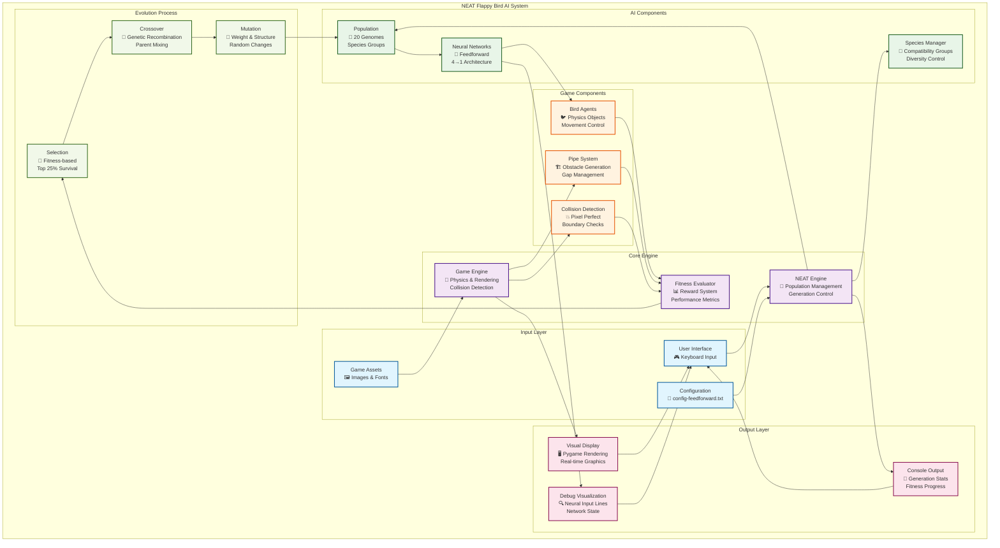

# NEAT Flappy Bird AI - System Block Diagram

## Overview
This document presents the high-level system architecture of the NEAT Flappy Bird AI, showing the major components and their relationships.

---

## Mermaid System Block Diagram



---

## Component Descriptions

### Input Layer
- **User Interface**: Keyboard input handling (D key for debug toggle, ESC for exit)
- **Configuration**: NEAT parameters from `config-feedforward.txt`
- **Game Assets**: Images, fonts, and visual resources

### Core Engine
- **NEAT Engine**: Orchestrates the evolutionary process, manages generations
- **Game Engine**: Handles physics simulation, rendering, and game logic
- **Fitness Evaluator**: Calculates rewards and penalties for AI performance

### AI Components
- **Population**: Collection of 20 genomes representing potential solutions
- **Neural Networks**: Feedforward networks created from genomes (4 inputs → 1 output)
- **Species Manager**: Groups similar genomes for diversity preservation

### Game Components
- **Bird Agents**: Physics-based objects controlled by neural networks
- **Pipe System**: Procedurally generated obstacles with random gap positions
- **Collision Detection**: Pixel-perfect collision checking and boundary validation

### Output Layer
- **Visual Display**: Real-time game rendering with Pygame
- **Debug Visualization**: Neural network input lines and state information
- **Console Output**: Generation statistics and training progress

### Evolution Process
- **Selection**: Fitness-based survival (top 25% advance)
- **Crossover**: Genetic recombination between high-performing parents
- **Mutation**: Random modifications to weights and network structure

---

## Text-Based System Architecture

```
┌─────────────────────────────────────────────────────────────────────────────┐
│                          NEAT Flappy Bird AI System                        │
├─────────────────────────────────────────────────────────────────────────────┤
│                                                                             │
│  INPUT LAYER                    CORE ENGINE                   OUTPUT LAYER  │
│  ┌─────────────┐               ┌─────────────┐               ┌─────────────┐ │
│  │ User Input  │──────────────▶│ NEAT Engine │──────────────▶│ Console     │ │
│  │ • Keyboard  │               │ • Population│               │ • Stats     │ │
│  │ • Commands  │               │ • Evolution │               │ • Progress  │ │
│  └─────────────┘               └─────────────┘               └─────────────┘ │
│                                       │                                     │
│  ┌─────────────┐               ┌─────────────┐               ┌─────────────┐ │
│  │ Config File │──────────────▶│ Game Engine │──────────────▶│ Visual      │ │
│  │ • NEAT Params│               │ • Physics   │               │ Display     │ │
│  │ • Mutations │               │ • Rendering │               │ • Graphics  │ │
│  └─────────────┘               └─────────────┘               └─────────────┘ │
│                                       │                                     │
│  ┌─────────────┐               ┌─────────────┐               ┌─────────────┐ │
│  │ Game Assets │──────────────▶│ Fitness     │──────────────▶│ Debug       │ │
│  │ • Images    │               │ Evaluator   │               │ Visualizer  │ │
│  │ • Fonts     │               │ • Rewards   │               │ • NN Lines  │ │
│  └─────────────┘               └─────────────┘               └─────────────┘ │
│                                       │                                     │
│                                       ▼                                     │
│  AI COMPONENTS                 GAME COMPONENTS                              │
│  ┌─────────────┐               ┌─────────────┐                              │
│  │ Population  │◀──────────────│ Bird Agents │                              │
│  │ • 20 Genomes│               │ • Physics   │                              │
│  │ • Species   │               │ • Control   │                              │
│  └─────────────┘               └─────────────┘                              │
│         │                             │                                     │
│         ▼                             ▼                                     │
│  ┌─────────────┐               ┌─────────────┐                              │
│  │ Neural      │◀──────────────│ Pipe System │                              │
│  │ Networks    │               │ • Obstacles │                              │
│  │ • 4→1 Arch  │               │ • Gaps      │                              │
│  └─────────────┘               └─────────────┘                              │
│         │                             │                                     │
│         ▼                             ▼                                     │
│  ┌─────────────┐               ┌─────────────┐                              │
│  │ Species     │◀──────────────│ Collision   │                              │
│  │ Manager     │               │ Detection   │                              │
│  │ • Diversity │               │ • Pixel     │                              │
│  └─────────────┘               └─────────────┘                              │
│                                                                             │
│  EVOLUTION PROCESS                                                          │
│  ┌─────────────┐     ┌─────────────┐     ┌─────────────┐                   │
│  │ Selection   │────▶│ Crossover   │────▶│ Mutation    │                   │
│  │ • Top 25%   │     │ • Genetic   │     │ • Weights   │                   │
│  │ • Elitism   │     │ • Mixing    │     │ • Structure │                   │
│  └─────────────┘     └─────────────┘     └─────────────┘                   │
│         ▲                                         │                        │
│         └─────────────────────────────────────────┘                        │
│                        Feedback Loop                                       │
└─────────────────────────────────────────────────────────────────────────────┘
```

---

## System Interactions

### Primary Data Flows
1. **Configuration → NEAT Engine**: Parameters control evolution process
2. **NEAT Engine → Population**: Creates and manages genomes
3. **Population → Neural Networks**: Genomes instantiated as networks
4. **Neural Networks → Bird Agents**: AI controls bird behavior
5. **Game Components → Fitness Evaluator**: Performance measurement
6. **Fitness Evaluator → Evolution Process**: Drives natural selection

### Feedback Loops
1. **Evolution → Population**: New generations based on fitness
2. **Display → User Interface**: Visual feedback for user interaction
3. **Console → User Interface**: Statistical feedback for monitoring

### Control Flows
1. **User Input → System Control**: Debug toggles, termination commands
2. **Fitness Threshold → Termination**: Success condition checking
3. **Generation Limit → Termination**: Timeout condition checking

This system block diagram illustrates how the NEAT algorithm integrates with the game environment to create an autonomous learning system that evolves optimal Flappy Bird playing strategies through natural selection.
